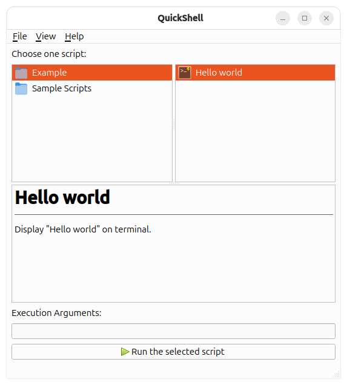

# QuickShell

## 简介

QuickShell 是一个基于 Qt6 开发的图形用户界面（GUI）脚本运行器，旨在提供一个简洁、直观的环境来编写、编辑和运行各种脚本。无论你是 Python、Bash、Perl 还是其他脚本语言的用户，QuickShell 都能帮助你更高效地管理和执行脚本。



> **警告：**
>
> 此项目正在完善中，部分功能仍在开发阶段！

## 安装

目前你可以通过以下两种方式以安装使用：

### 安装包

你可以前往 [Github Release](https://github.com/CatIsNotFound/QuickShell/releases/latest) 页面以获取最新的安装包。

### 源代码构建

#### 第一步：克隆

在终端下执行命令：

```sh
git clone https://github.com/CatIsNotFound/QuickShell.git
```

#### 第二步：构建项目

>**注意：**
>
> 在进行构建前，请先安装**含有 Qt6.5 及以上版本的必要组件及其必要依赖**！如果已安装 Qt Creator，请在 Qt Creator 下使用 Cmake for Qt 6.x 以构建项目。

```sh
cd QuickShell
mkdir build && cd build
cmake ..
```
